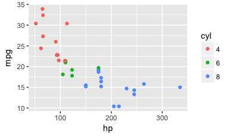
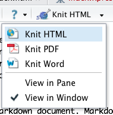

<!--
## Overview
# 
# X 1. Overview of the Aspects of Reproducible Research (link to ASA doc)
# X 1. Basic Guidelines for Scientific Computing  (folder structure, relative paths, etc.)
# 1. Reproducible Reporting - What is it?
# 1. Motivating Examples (patients added, data revised, reviewer questions, reader questions)
# 1. Use Scenarios - Analysis notebooks, analysis reports, manuscript, other (presentations, web pages, etc.)
# 1. Technologies/Tools ("pipelines") (Rmd -> md -> html/doc/pdf/ )
# 1. Rmarkdown via RStudio
#
-->
Materials
---------

<http://github.com/mmulvahill/rr_workshops.git>

Prereqs -- Software to install
------------------------------

**Test software install on fresh computer**

-   [R](https://cloud.r-project.org/)
-   [RStudio](https://www.rstudio.com/products/rstudio/download/#download)

**If you are not using RStudio, you will also need these:**

-   [pandoc](https://pandoc.org/installing.html)
-   `rmarkdown` package
-   `knitr` package

``` r
install.packages(c("rmarkdown", "knitr"))
```

Defining Reproducibility
========================

<!--
##

<div class="verticalcenterdiv">
> Reproducibility is the only thing an investigator can guarantee about a study.

[Roger
Peng](https://simplystatistics.org/2014/06/06/the-real-reason-reproducible-research-is-important/)
</div>

<div class="footer"> Introduction </div>
-->

-   Reproducibility
    -   “A study is reproducible if you can take the original data and the computer code used to analyze the data and reproduce all of the numerical findings from the study.” <br> <br> <br>
-   Replicability
    -   “...the act of repeating an entire study, independently of the original investigator without the use of original data (but generally using the same methods).”

ASA Recommendations to Funding Agencies Supporting Reproducible Research - Broman et al. (2017)

<!-- ****************************************** -->
<!-- ******* Start of Principles series ******* -->
<!-- ****************************************** -->
<!-- ** 1.   ********************************** -->

**Principles of Reproducibility**

-   Ideally, the use of ***publicly available data***.
-   Use of ***version control*** for all code development.
-   Exclusive use of ***open-source software***, freely available worldwide.
-   ***End-to-end scripting*** of research (data processing/cleaning, statistical analyses, visualizations, and ***report/manuscript generation***) with full workflow made available to others.
-   Use of ***container/virtual machine tools*** to capture software versions, dependencies, and platform specifics.
-   ***Publication of code*** in public repositories, as with data.
-   Implementing algorithms on standard computational platforms (R/Python packages, etc.)

ASA Recommendations to Funding Agencies Supporting Reproducible Research - Broman et al. (2017)

<!-- ** 2.   ********************************** -->

**Principles of Reproducibility -- HIPAA**

-   Ideally, the use of ***publicly available data***.
-   Use of ***version control*** for all code development.

-   Exclusive use of ***open-source software***, freely available worldwide.

-   ***End-to-end scripting*** of research (data processing/cleaning, statistical analyses, visualizations, and ***report/manuscript generation***) with full workflow made available to others.

-   Use of ***container/virtual machine tools*** to capture software versions, dependencies, and platform specifics.

-   ***Publication of code*** in public repositories, as with data.
-   Implementing algorithms on standard computational platforms (R/Python packages, etc.)

ASA Recommendations to Funding Agencies Supporting Reproducible Research - Broman et al. (2017)

<!-- ** 3.   ********************************** -->

**Principles of Reproducibility -- Advanced tools**

-   Ideally, the use of ***publicly available data***.

-   Use of ***version control*** for all code development.

-   Exclusive use of ***open-source software***, freely available worldwide.

-   ***End-to-end scripting*** of research (data processing/cleaning, statistical analyses, visualizations, and ***report/manuscript generation***) with full workflow made available to others.

-   Use of ***container/virtual machine tools*** to capture software versions, dependencies, and platform specifics.
-   ***Publication of code*** in public repositories, as with data.

-   Implementing algorithms on standard computational platforms (R/Python packages, etc.)

ASA Recommendations to Funding Agencies Supporting Reproducible Research - Broman et al. (2017)

<!-- ** 4.   ********************************** -->

**Principles of Reproducibility -- Our Toolkit**

-   Ideally, the use of ***publicly available data***.

-   Use of ***version control*** for all code development.
-   Exclusive use of ***open-source software***, freely available worldwide.
-   ***End-to-end scripting*** of research (data processing/cleaning, statistical analyses, visualizations, and ***report/manuscript generation***) with full workflow made available to others.
-   Use of ***container/virtual machine tools*** to capture software versions, dependencies, and platform specifics.

-   ***Publication of code*** in public repositories, as with data.

-   Implementing algorithms on standard computational platforms (R/Python packages, etc.)

ASA Recommendations to Funding Agencies Supporting Reproducible Research - Broman et al. (2017)

<!-- ****************************************** -->
<!-- ******** End of Principles series ******** -->
<!-- ****************************************** -->

-   Scientific computing basics
-   Reproducible reports
-   Version control

Our Agenda

Scientific computing basics
===========================

1.  Naming files and directories
2.  Structuring projects and related coding conventions
3.  Coding style

Scientific computing basics

**File and directory naming**

-   Assume case-sensitivity
-   Spaces = bad
-   Use camelCase, PascalCase, or delimiter\_separated
-   Use numbering for files executed sequentially
-   0-padding for numbered names to retain sorting (e.g. 01, 02,... 10)
-   Use the standard (ISO 8601) format for dates: YYYY-MM-DD or YYYYMMDD
-   Use descriptive names and only obvious abbreviations

Scientific computing basics

**File and directory naming**

Good project directory name:

        StatinDiscontinuationStudy

Good filenames:

        01_clean_data.R
        02_descriptives.R
        03_analysis_aim1_hypothesis1.R
        04_analysis_aim1_hypothesis2.R
        05_analysis_aim2_hypothesis1.R

Scientific computing basics

**Project structure**

-   New users should be able to quickly recognize and comprehend the structure.
-   Include a README file to explain structure, what files do, and how to execute them.
-   Use a build script, makefile, or *designate a master file*

-   Set working directory once and otherwise use *relative file paths*

``` r
# Setting working directory
setwd("C:/Users/myusername/Projects/thisprojectdirectory")
# and using relative filepaths
mydata <- read.csv("./data/my_raw_data_file.csv")
source("./R/01_clean_data.R")
```

Scientific computing basics

**Project structure**

    ## reproducible_reporting/
    ## ├── build.R
    ## ├── docs
    ## │   ├── rmarkdown-cheatsheet-2.0.pdf
    ## │   └── rmarkdown-reference.pdf
    ## ├── examples
    ## │   ├── justmarkdown.html
    ## │   ├── justmarkdown.md
    ## │   ├── myexample.docx
    ## │   └── myexample.Rmd
    ## ├── lib
    ## │   ├── images
    ## │   ├── references.bib
    ## │   └── styles.css
    ## ├── output
    ## │   ├── figures
    ## │   ├── reporting_presentation.html
    ## │   └── reporting_presentation.md
    ## ├── README.md
    ## ├── reporting_presentation.html
    ## ├── reporting_presentation.md
    ## ├── reporting_presentation.Rmd
    ## ├── reproducible_reporting.Rproj
    ## └── Rmd
    ##     ├── 01_introduction.Rmd
    ##     ├── 02_computing_basics.Rmd
    ##     ├── 03_intro_to_reporting.Rmd
    ##     ├── 04_rmarkdown.Rmd
    ##     ├── 05_rmdexample.Rmd
    ##     └── 06_advanced.Rmd
    ## 
    ## 7 directories, 22 files

**Project structure**

    MyProject/
        |— data/
              |— rawdata/
        |— documents/
        |— libraries/
        |— output/
              |— figures/
              |— tables/
              |- myreport.docx
        |— R/
        |- Rmd/
              |- myreport.Rmd
        |— sas/
        |— build.R
        |— README.txt

Scientific computing basics

**Code style**

-   All code files should be executable, and sequentially so.
-   Minimize extraneous operations, or move to an 'appendix' script.
-   Limit line length (80 or 100 characters)
-   Limit file length to "something reasonable" (~ 100 lines)

Scientific computing basics

**Code style**

-   Use comments to explain 'why', good code to explain 'what'.
-   Use headers at top of file and to denote major sections.
-   Human readable first, optimization second.
-   Consistent indenting, capitalization, and spacing.
    -   Use spaces around operators =+-/\*&%$ and after commas.
-   Consistency is key!
-   Use a [style](https://google.github.io/styleguide/Rguide.xml) [guide](http://adv-r.had.co.nz/Style.html)

Scientific computing basics

Reproducible reporting
======================

**What is a reproducible report?**

A report where the text content is combined with the computer code necessary for generating all included tables, plots, and statistics.

``` r
data(mtcars)
mtcars <- mtcars %>% mutate(cyl = factor(cyl))
ggplot(mtcars, aes(x = hp, y = mpg, color = cyl)) +
  geom_point() 
```



Reproducible reporting

**Why reproducible reports**

To tie reported statistics to the code that creates them so other researchers can understand and verify results.

But really to make your life easier when:

-   Datasets updated
-   Patients added/removed from analysis
-   Changes required due to investigator requests
-   Changes required due to reviewer comments

By allowing you to:

-   Create consistency between tables and text
-   Avoid tedium

Reproducible reporting

**Three related concepts**

-   Dynamic documentation
    -   Focus is code documentation
    -   e.g. doxygen (C++), roxygen2 (R)
-   Literate program
    -   Focus is explaining the code/process
    -   e.g. R Markdown (R Notebook), Jupyter notebook
-   Reproducible report
    -   Focus is the report -- interpretation and results
    -   e.g. R Markdown (to PDF, Word, HTML), Rnw/LaTeX to PDF

Reproducible reporting

<!---->

Reproducible reporting

**Our options**

-   R + LaTeX (PDF)
-   R Markdown (HTML, Word, PDF)
-   Jupyter notebooks (HTML)
-   [StatTag](http://sites.northwestern.edu/stattag/) (Word)

  

Reproducible reporting

**Why [R Markdown](http://rmarkdown.rstudio.com/authoring_quick_tour.html)**

-   Variety of outputs
-   Variety of analysis, data processing, and coding languages
-   Focus on text and analysis, formatting later
-   Simple, but extensible
-   Free Open Source pipeline (\*see Principles of Reproducibility), with options for incorporating proprietary software.

Reproducible reporting

**The process in RStudio**

1.  Write an R Markdown file (.Rmd)
2.  Press a button
3.  Get a pretty HTML, Word, or PDF file



-   If not using RStudio, use `render()` from the `rmarkdown` package

Reproducible reporting

**The process behind the scenes**

<center>
 
</center>
-   Both the "knit" button and the `render()` function automate the knitr-to-output pipeline.

Reproducible reporting

**The process behind the scenes**

-   The R package [knitr](https://yihui.name/knitr/) converts R code to markdown (or LaTeX) formatted text.
-   The external software [pandoc](https://pandoc.org/) converts the resulting markdown document to the final format of your choice.

Reproducible reporting

RMarkdown
=========

**Writing an Rmarkdown file**

First create a plain text file and save it as a .Rmd file.

1.  Markdown
2.  YAML header
3.  Code -- chunks and inline
4.  [Chunk (knitr) options](https://yihui.name/knitr/options/)

Anatomy of an R Markdown file (.Rmd)

**Markdown**

Simple markup language originally designed for quickly making webpages

    ### Header 3

    - list item 1
    - list item 2
    - list item 3

    1. enemated item 1
    1. enemated item 2
    1. enemated item 3

    **Bold**, *italicized*, _underlined_ text

Anatomy of an R Markdown file (.Rmd)

**Markdown**

Simple markup language originally designed for quickly making webpages

### Header 3

-   list item 1
-   list item 2
-   list item 3

1.  enemated item 1
2.  enemated item 2
3.  enemated item 3

**Bold**, *italicized*, ~~strikethrough~~ text

Anatomy of an R Markdown file (.Rmd)

**YAML header**

-   YAML is a data serialization language.
-   RMarkdown uses it to define document metadata and configuration.
-   Should be at the top of the file and preceded and succeeded by three hyphens.

<!-- -->

    ---
    title: "Example Analysis for Reproducible Reporting Workshop"
    author: "Matt Mulvahill"
    date: "September 6, 2017"
    output: word_document
    ---

Anatomy of an R Markdown file (.Rmd)

**Code chunks**

-   Started with three backticks (upper left-most key, below ESC), and open/close curly braces. Chunk is ended with three backticks.
-   Within curly braces we denote the 'engine'/language ("r"), a name for the code chunk, then any chunk options we want.

<pre><code>```{r my_model_fit, echo=TRUE}
# fit model
data(mtcars)
mtcars$cyl <- factor(mtcars$cyl)
fit <- lm(mpg ~ cyl, data = mtcars)
```</code></pre>
<pre><code>```{r my_model_summary, echo = TRUE, results='markdown'}
# create summary table
fit %>% broom::tidy(.) %>%
  mutate_at(vars(estimate:statistic), round, digits=2) %>%
  mutate_at(vars(p.value), qwraps2::frmtp) %>% 
  kable
```</code></pre>
Anatomy of an R Markdown file (.Rmd)

**Code chunk example**

``` r
# fit model
data(mtcars)
mtcars$cyl <- factor(mtcars$cyl)
fit <- lm(mpg ~ cyl, data = mtcars)

# extract and format coefficients table
coef_table <- fit %>% broom::tidy(.) %>%
  mutate_at(vars(estimate:statistic), round, digits=2) %>%
  mutate_at(vars(p.value), qwraps2::frmtp, markup = "markup")
```

``` r
# print formatted coefficients table
coef_table %>%
  kable(., "html", table.attr = "class=\"mytable\"",
        caption = "Table 1. Regression coeffients and related statistics")
```

<table class="mytable">
<caption>
Table 1. Regression coeffients and related statistics
</caption>
<thead>
<tr>
<th style="text-align:left;">
term
</th>
<th style="text-align:right;">
estimate
</th>
<th style="text-align:right;">
std.error
</th>
<th style="text-align:right;">
statistic
</th>
<th style="text-align:left;">
p.value
</th>
</tr>
</thead>
<tbody>
<tr>
<td style="text-align:left;">
(Intercept)
</td>
<td style="text-align:right;">
26.66
</td>
<td style="text-align:right;">
0.97
</td>
<td style="text-align:right;">
27.44
</td>
<td style="text-align:left;">
P &lt; 0.0001
</td>
</tr>
<tr>
<td style="text-align:left;">
cyl6
</td>
<td style="text-align:right;">
-6.92
</td>
<td style="text-align:right;">
1.56
</td>
<td style="text-align:right;">
-4.44
</td>
<td style="text-align:left;">
P = 0.0001
</td>
</tr>
<tr>
<td style="text-align:left;">
cyl8
</td>
<td style="text-align:right;">
-11.56
</td>
<td style="text-align:right;">
1.30
</td>
<td style="text-align:right;">
-8.90
</td>
<td style="text-align:left;">
P &lt; 0.0001
</td>
</tr>
</tbody>
</table>
Anatomy of an R Markdown file (.Rmd)

**Inline code example**

-   Inline code begins with a backtick and the engine name (r), and ends with a single backtick

``` r
# Prepare inline stats from table
coef_6cyl <- coef_table %>% filter(term == 'cyl6') %>% .$estimate
```

**RMarkdown text**

Cars with 6 cylinder engines average `` `r abs(coef_6cyl)` `` lower miles per gallon than 4 cylinder cars.

**Result**

Cars with 6 cylinder engines average 6.92 lower miles per gallon than 4 cylinder cars.

Anatomy of an R Markdown file (.Rmd)

**Chunk options**

-   Global options are set in a code chunk using `opts_knit$set()`

``` r
opts_knit$set(fig.width  = 6,
              fig.height = 4,
              fig.path   = "output/figures/"
              echo       = FALSE,
              warnings   = TRUE,
              messages   = TRUE)
```

-   Chunk-specific options are set in the chunk header (must all be on one line)

<pre><code>```{r mychunk, echo=TRUE, results='markup'}</code></pre>
Anatomy of an R Markdown file (.Rmd)

Hands-on Example
================

Advanced topics
===============

-   [Reproducible web documents with R, knitr, & Markdown](http://cpsievert.github.io/slides/markdown/#/)

Useful links

References

Broman, Karl, Mine Cetinkaya-Rundel, Amy Nussbaum, Christopher Paciorek, Roger Peng, Daniel Turek, and Hadley Wickham. 2017. “Recommendations to Funding Agencies for Supporting Reproducible Research.”
